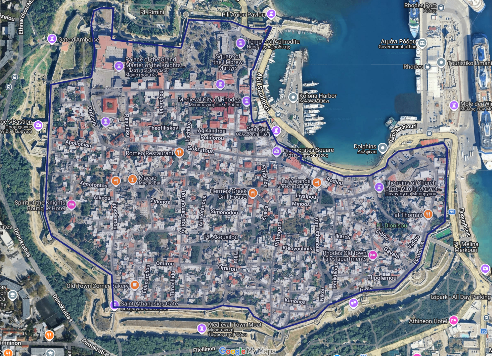

# Photo-Clue Infection Hide & Seek

A one-page, mobile-friendly rules site for the game. GitHub Pages publishes the site automatically from the `main` branch.

## Edit the rules

The complete player-facing rules live in [`rules.md`](rules.md). This is the only file you normally need to edit.

1. Open `rules.md` on GitHub.
2. Select the pencil icon.
3. Make the change and commit it to `main`.
4. GitHub Pages will rebuild the public site automatically, usually within a few minutes.

## Preview Markdown before publishing

Open the [Rules Markdown Previewer](https://mmaxin.github.io/hide-and-seek-game/testing/) at `/testing/` to experiment without changing the public guide.

1. Select **Load current rules**, or paste Markdown into the editor.
2. Check the page preview as you type. It uses the same rule-card styling as the live site.
3. Select **Copy Markdown** when the draft is ready.
4. Paste it into `rules.md` on GitHub and commit the change to publish it.

The previewer autosaves one draft in the current browser. That draft never leaves the device and does not publish automatically. **New blank draft** clears it, while **Download .md** saves a backup file. Potentially unsafe HTML is removed from previews; the existing map-button HTML is supported.

## Keep a draft section hidden

Wrap an unfinished section in Jekyll comment tags to keep it in `rules.md` without rendering it on the site:

```liquid

## Future rule

This text stays in rules.md but is omitted from the rendered guide.

```

Use this for future rules, alternate wording, or notes that maintainers want to retain. Delete the opening `` and closing `` lines when the section is ready to publish, then add a unique anchor below its heading.

The `/testing/` previewer also omits these blocks and reports how many hidden sections it found. The tags are **not a security feature**: anyone can still read hidden text in the public GitHub repository or the raw Markdown file. Never place passwords, private player data, or other secrets in `rules.md`.

## What does `#objective` do?

`#objective` is an **in-page anchor**: a permanent name for the Objective section. It lets the site navigation, guide search, and shared links jump directly to that section.

In `rules.md`, the heading and its anchor look like this:

```md
## 1. Objective
{: #objective }

Score the most points by staying hidden or by finding Hiders.
```

The first line creates the visible heading. The second line gives that heading the HTML ID `objective`. The `#` appears in links, so the direct URL is:

```text
https://mmaxin.github.io/hide-and-seek-game/#objective
```

Use anchors when a section needs to be linkable or searchable. Anchor names must be unique and should use lowercase words separated by hyphens. Avoid renaming an existing anchor: doing so breaks previously shared links and may require matching updates in `_layouts/default.html` and `assets/js/site.js`.

### Current section anchors

| Section | Anchor used in links |
| --- | --- |
| Objective | `#objective` |
| Roles & items | `#roles` |
| Game size & teams | `#teams` |
| General rules | `#general-rules` |
| Locked hiding location | `#locked-location` |
| Scoring | `#scoring` |
| Photo clues | `#photo-clues` |
| How a find works | `#finds` |
| Boundaries & movement | `#boundaries` |
| Safety, rulings & end of game | `#safety` |
| Game map & zones | `#map` |

Every anchored level-two heading is included automatically in guide search. Selected anchors are also used by the navigation bar.

## Elements used in `rules.md`

These are all the content patterns currently used in the rules, with an example and the best use case for each.

### Section heading and anchor

```md
## 7. Photo clues
{: #photo-clues }
```

Use a level-two heading (`##`) for a main rule section. Put its anchor on the next line so navigation, search, and direct links can find it.

### Hidden draft section

```liquid

## Rule being drafted

Unpublished wording goes here.

```

Use a Jekyll comment block to retain an entire draft section without rendering it. Both tags must be on their own lines, outside any code fence.

### Subheading

```md
### Hider survival points
```

Use a level-three heading (`###`) to divide a main section into smaller topics. Subheadings are not separate guide-search results.

### Paragraph

```md
Score the most points by staying hidden or by finding Hiders.
```

Use plain text for short explanations. Leave a blank line before and after a paragraph.

### Bullet list

```md
- Walking only. No running.
- Stay in public, legal, safe areas only.
```

Use bullets for separate rules that players may need to scan quickly.

### Nested bullet list

```md
- Starting Seekers score:
  - **6–10 players:** +3 points per Hider item
  - **11+ players:** +2 points per Hider item
```

Use two leading spaces before `-` when details belong under a parent rule.

### Bold emphasis

```md
Immediately become an **Infected Seeker**.
```

Use `**bold text**` for important terms, values, and short warnings. Avoid bolding entire paragraphs.

### Strikethrough

```md
~~**Starting Seekers** = total players ÷ 6~~
```

Use `~~strikethrough~~` to show that wording or a calculation has been intentionally retired while leaving it visible for comparison. Players will still see the crossed-out text; use a hidden draft section instead when content should not render at all.

### Table

```md
| Players | Starting Seekers |
| --- | ---: |
| 6–10 | 2 |
| 11–15 | 3 |
```

Use a table for values players compare by row, such as team sizes, points, or clue times. The second row is required. `---` uses normal alignment; `---:` right-aligns a numeric column.

### Callout

```md
> **Final score** = Hider items collected + survival points.
```

Use `>` for a short summary, formula, game-day reminder, or source-of-truth notice that should stand out from the surrounding rules.

### Preformatted message template

````md
```text
FOUND
Hider: [Name]
Found by: [Name]
Time: [H:MM]
```
````

Use a fenced `text` block for WhatsApp messages or other content players should copy exactly. Keep both lines of three backticks.

### Link

```md
[Open the live game map](https://example.com/map)
```

Use a link when descriptive text should open another page. Put the label in square brackets and the destination immediately after it in parentheses.

### Image

```md

```

Use an image for a visual reference. The text in square brackets is alternative text for accessibility and should describe what the image shows.

### Clickable image

```md
[](https://example.com/live-map)
```

Wrap image syntax in link syntax when selecting the image should open a larger or live version. The rules use this pattern for the static map preview.

### Styled button (advanced)

```html
<a class="button map-button" href="https://example.com/live-map" target="_blank" rel="noopener">Open the live game map →</a>
```

Use this only when a prominent action button is needed. It is raw HTML rather than normal Markdown; copy the existing pattern and change only the URL and visible label. Keep `rel="noopener"` whenever `target="_blank"` opens a new tab.

## Safe editing checklist

- Edit wording, bullets, times, point values, and table rows freely in `rules.md`.
- Keep every existing `{: #anchor-name }` line unless you also update all navigation, search, and shared-link references.
- Keep unfinished sections between `` and ``; remove both tags to publish the section.
- Leave blank lines around headings, lists, tables, callouts, and code blocks.
- Preview the changed file on GitHub before committing if you alter Markdown structure.
- Keep player-facing content in `rules.md`; change layout, behaviour, or appearance only in the files listed below.

## Update zones or the map

- The live Google My Map is the source of truth. Changes made to zones in that map appear immediately without rebuilding this site.
- Treat the current full boundary as the **Entire Zone** in player-facing rules. Add future zones to the live map, then describe any zone-specific rules in the map section at the bottom of `rules.md`.
- Replace `assets/game-map.png` with a fresh screenshot using the same filename whenever the static Entire Zone preview becomes outdated.
- If the site moves to a different Google My Map, update both live-map links at the bottom of `rules.md`.

## Site structure

| File | Purpose |
| --- | --- |
| `rules.md` | All player-facing rule content |
| `index.md` | Loads the rules onto the home page |
| `_layouts/default.html` | Page frame, navigation, search panel, and share/print actions |
| `_layouts/testing.html` | Page frame for the `/testing/` Markdown previewer |
| `assets/css/style.css` | Mobile, desktop, and print styling |
| `assets/css/testing.css` | Previewer layout and editor styling |
| `assets/js/site.js` | Share button and automatic guide search |
| `assets/js/testing.js` | Local Markdown rendering, autosave, copy, and download tools |
| `assets/vendor/marked.umd.js` | Vendored Markdown parser used only by the previewer |
| `assets/game-map.png` | Static map preview shown in the rules |
| `_config.yml` | Site title, URL, and GitHub Pages settings |

The site uses GitHub Pages' built-in Jekyll support, so there is no JavaScript framework, package manager, or dependency update process to maintain.
