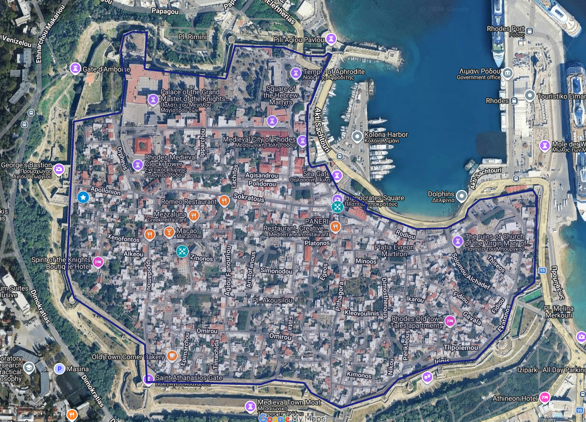

> **10 min to hide** · **4 rounds × 15 min**  · **1 photo clue each round!**

## 0. Summary
{: #summary }

We're playing Hide-and-Seek inside the walled Old Town of Rhodes! It's a big, bustling neighborhood, so Hiders will send photo clues to the Seekers!

|    Time | Description         |                                                                   |
| ------: | ------------------- | :---------------------------------------------------------------- |
|         | *Meet at Home Base* | **[*Platia Arionos*](https://maps.app.goo.gl/dgDLizPcn8gEu1z48)** |
| -10 min | **Hide Countdown**  | **Hiders** hide!                                                  |
|   0 min | Round 1 · Photo due | **Seekers** released!                                             |
|  15 min | Round 2 · Photo due |                                                                   |
|  30 min | Round 3 · Photo due |                                                                   |
|  45 min | Round 4 · Photo due |                                                                   |
|  60 min | Game End            | Surviving Hiders win!                                             |
|         |                     |                                                                   |

<a class="button map-button" href="https://www.google.com/maps/d/viewer?mid=1K333qr3YPDbJbKSe0Sf76sPG-eI42dM&amp;usp=sharing" target="_blank" rel="noopener">Google Maps →</a>

> **Rules are bold. Please read the bold text!**

- *Italics is for optional explanation. Read these for more info, hints, and context!*

## 1. Objective
{: #objective }

> **All surviving Hiders win the game, regardless of score!**

> **Otherwise, score the most points to win!**

### Hiders

> **Send photos to score points while staying hidden!**

### Seekers
> **Find Hiders to score points!**

## 2. Set Up
{: #setup }

### Join the Group Chat!
{: #chat }

> **All players must join the Hide & Seek WhatsApp group chat before starting the game.**

- *Each player needs a cell phone with a full battery, a camera, and a data plan!*
- *We might use up to 0.3 gigs, depending on player count.*

### Choose Hiders & Seekers!
{: #teams }

> **Starting Seeker is an opt-in position. But found Hiders become Seekers too!**

- *Let us know if you're excited to be a Starting Seeker!*

- *The game is not over when you're found, you just switch teams!*

| Total Players | Starting Seekers |
|---:|:---:|
| 8–10 | 2 |
| 11–14 | 3 |
| 15–19 | 4 |
| 20–25 | 5 |
| 26-32 | 6 |

> **Starting Seekers will spend the entire game searching for Hiders.**
>
> **Each Starting Seeker needs an *Orange Seeker necklace.***

> **All other players begin the game as Hiders, and become Seekers if found.**
> 
> **Each Hider needs a *Green Hider necklace,* and an *Orange Seeker necklace.***

- *If you want to hide in pairs, you'll both count as one player, and you must hold hands the entire game! Please let everyone know you're doing this!*

### Review the Map Boundaries!
{: #boundaries }

> **All players must stay *within* the Old Town walls during the entire game.**

- *Please do not hide in the walls, on the walls, or outside the walls.*

[

<a class="button map-button" href="https://www.google.com/maps/d/viewer?mid=1K333qr3YPDbJbKSe0Sf76sPG-eI42dM&amp;usp=sharing" target="_blank" rel="noopener">Google Maps →</a>

> **All players must stay outdoors.**

- *If a door could close behind you, you're probably indoors. This includes most shops!*

- *Outdoor spaces that require going indoors to access are also not allowed.*

> **All players must stay in public spaces.**

- *Trespassing on private property is both illegal **and** against the rules, you hooligans.*

> **All players must not pay for access to exclusive spaces.**

- *Please do not spend money or promise favours for a better hiding spot.*

- *Landmarks with free public access are allowed, as long as they are outdoors.*

### Safety Always!
{: #safety }

> **All players must act in a safe, polite, and respectful manner at all times!**

- *Please please don't act shady while hiding! Make sure the locals don't think you're about to mug them from behind a bush.*

- *Please please be careful near cars, and avoid injuries of any kind!*

> **No running!**

- *If you see anyone running, tell them Mike will be very disappointed in them.*

### Meet at Home Base!
> **All players must start the game at Home Base**.

- **[*Platia Arionos* (Πλατεία Αρίωνος)](https://maps.app.goo.gl/dgDLizPcn8gEu1z48)** *is a small, central plaza with a tree and a well.* 

> **Starting Seekers begin wearing their *Orange Seeker necklace.***

> **Hiders begin wearing their *Green Hider necklace*, and must carry their *Orange Seeker necklace.***

> **All players must send a selfie from Home Base.**

- *Some of you are meeting for the first time today! Give everyone a reference picture!*

> **All players must continue wearing one of their necklaces until the game ends.**

- *Don't take your necklace off, it's already hard enough to find you as it is!*

## 3. Playing the Game
{: #start }

### Start the Countdown: 10 minutes

> **Hiders have a 10 minute Countdown to choose their hiding spot anywhere within the Map boundaries.**

- *It's a 9 minute walk from **Platia Arionos** to the furthest map boundary. No need to run, just walk with purpose!*

> **Starting Seekers must remain at Home Base during the 10 minute Countdown.**

### Start the Hunt: 4 Rounds × 15 min

> **To begin Round 1, each Starting Seeker must begin a 1-hour live location-share with the group.**

> **A game has 4 rounds, lasting 15 minutes each.**

### Photo Windows: First 2 min / Round

> **The first 2 minutes of each round is the Photo Window.**
> 
> **Hiders must submit their photos during this time!**

- *This includes the first round, just as the Seekers are being released!*

- *See Photo Scoring below for points.*

## 4. Hiding Rules
{: #hiding }

> **Hiders must take their photo from the exact location they intend to stay.**

- *If you move more than 5 steps for any reason, that counts as a Reposition! Avoid hiding anywhere you might be told to move.*

- *If you could no longer take your photo again (such as by stepping around a corner), you've Repositioned!*


- This used to be 13-15 steps, or 10 meters. That's like a tennis court, a lot of room for shenanigans.


### Reposition Rules
{: #reposition }

> **Hiders may Reposition during the Photo Window *(the first 2 minutes of each round),* abandoning their current location and moving to a new hiding spot.**

- *Consider Repositioning when it seems like Seekers have figured out exactly where you are. That 2-minute window is your chance for survival!*

- *You can still be found while repositioning!*

> **Hiders may *not* Reposition after the Photo Window ends for that round.**

- *Wherever you are at the 2 minute mark is your new location! You must stop moving, and send your photo from there.*

> **Hiders must include "REPOSITION!" when they send their photo for that round.**

- *REPOSITION! Door Sign Road!*

> **Points scored for all abandoned locations are halved!**

- *Just do the math once at the end of the game. If you reposition more than once, **don't** start working out half of half of half lol.*


- If you repositioned at the end of round 2 and round 3, you'd score half points for rounds 1 & 2, half points from your second location in round 3, and  for your final location. Your best possible score would be 25 points (5 + 5 [REPOSITION!] + 5 [REPOSITION!] + 10).


## 5. Photo Scoring: Door, Sign, Road
{: #scoring }

> **Hiders score points by including Doors, Signs, and Roads in their photo.**

> **Please send "DOOR", "SIGN", and/or "ROAD" with your photo to indicate which features you included!**

- *Each photo can score up to 12 points (with a door, a sign, and a road). Up to 48 points can be earned per game.*

- *You're welcome to do the math during the game, but honestly just give me "DOOR SIGN ROAD".*

- *Yes, this is all fully subjective to what Jo decides counts. Assume I'm unconvinced by your shenanigans!*

> **Hiders score their points as soon as Mike receives their photo.**

- *Your effort is rewarded immediately!*

> **Hiders score points *once* for each feature category they include in their photos.**

- *A photo with a dozen doors in it still only scores 2 points, not 24 points.*

- *Features only count if they're obviously visible without zooming in on a phone. There might be a tiny sign in the back there, but I won't be squinting to find it!*

> **Each unique feature can only be used to score points in one photo.**

- *Sending the same door in two photos scores only once. Take unique photos please!*

> **Photos submitted late score -1 point for arriving outside the Photo Window, and -1 point for every additional minute late.**

- *If you don't submit a photo at all, it's 0 points. You need to send photos to win!*

- *Late penalties are determined by the photo's arrival time to Mike's phone, not by sender time. Seekers need to have actually received your photo!*

### Door: 2 points
{: #door}

- *The entire door must be visible; partial doors don't count.*

- *I'll probably accept gates, garage doors, and distinctly historical archways with a through-path (despite many not having an actual door, they're just cool).*

- *I'll probably reject vehicle doors, windows, and open doorways that don't show their door in full (especially if it's not even a cool archway).*

### Unique Sign: 4 points
{: #sign }

- *The entire sign must be visible; partial signs don't count.*

- *I'll probably accept street names, store signs, and distinct artworks (if it's large enough, I might even accept it without text).*

- *I'll probably reject stickers, posters, generic road signs (i.e. stop sign), and signs without legible text (faded signs, information panels).*

### End of the Road: 6 points
{: #road }

- *The **end** of the road must be visible: We need to see down the road, not across the road!*

- *I'll probably accept any path, alley, or road where both interior walls are visible (you can't see the end of a curving road, but both walls is good enough).*

- *I'll probably reject plazas, hallways (indoors is illegal!), and roads where only one wall is visible (that's looking across the road!).*

- *For maximum points, you'll need to be at an intersection to be able to send multiple photos of unique roads from a single location!*

## 6. Getting Found
{: #finds }

> **Seekers score 20 points for each Hider they find!**

- *Surviving Hiders can score up to 48 points. If you find 3 hiders, you'll score 60 points!*

### Seekers Finding Hiders


- A **Seeker** makes a valid find by reaching the **Hider** first, getting within about three metres, clearly identifying the **Hider**, and saying:


> **Seekers who find a Hider should shake their hand and say “Found you!”**
> 
> **Then, take a selfie with them!**

- *Please don't scare random locals.*

> **Please send your selfie to the group as evidence of your find, including "[NAME] FOUND!"**

- *The find time is determined by your selfie photo's time stamp, not by send time or arrival time (in case of close calls, like a find at 59 minutes). But do send it promptly please!*

> **Then graciously receive your reward, their *Green Hider necklace!***

### Hiders Getting Found

> **When a Hider is found, they must shake the Seekers hand, then take the selfie with them.**

- *If multiple Seekers arrive around the same time, the Hider chooses whose hand to shake for the win.*

> **Then give the Seeker your *Green Hider necklace,* and put on your *Orange Seeker necklace* instead!**

> **To begin seeking, please begin a 1-hour live location share with the group!**
> 
> **You are now a Seeker!**

- *Found Hiders become Seekers pretty quickly. Avoid hiding in sight of other Hiders!*

## 7. Winning the Game!

> **After 4 rounds (60 minutes), all remaining Hiders win the game! Please send a selfie revealing your hiding spot, along with "I WIN!"

> **All players should return to Home Base now.**

> **If no Hiders remain, the player with the highest score wins the game!**

> **Please submit your score on the Leaderboard to see your ranking!**

- *We'll be reviewing the scores for the top players to confirm their wins!*



## Adjusting the game
### Seekers too strong
- Increase the Hide Countdown from 10 minutes to 15 minutes. Note that Old Town Rhodes is 15 minutes across.

### Hiders too strong
- Reduce Reposition window from 2 minutes to 1 minute. Avoid reducing to 0 minutes, to prevent new Seekers from immediately catching nearby Hiders.

The live game map will continue to be updated as zones are added. For now, **Entire Zone** is the full playable area outlined in blue below. Remember that boundary streets count only on the inside sidewalk.


## 8. Live Map
{: #map }

> **On game day:** use the live map as the source of truth. The image below is a quick reference for the current Entire Zone.

<a class="button map-button" href="https://www.google.com/maps/d/viewer?mid=1K333qr3YPDbJbKSe0Sf76sPG-eI42dM&amp;usp=sharing" target="_blank" rel="noopener">Open the live game map →</a>

